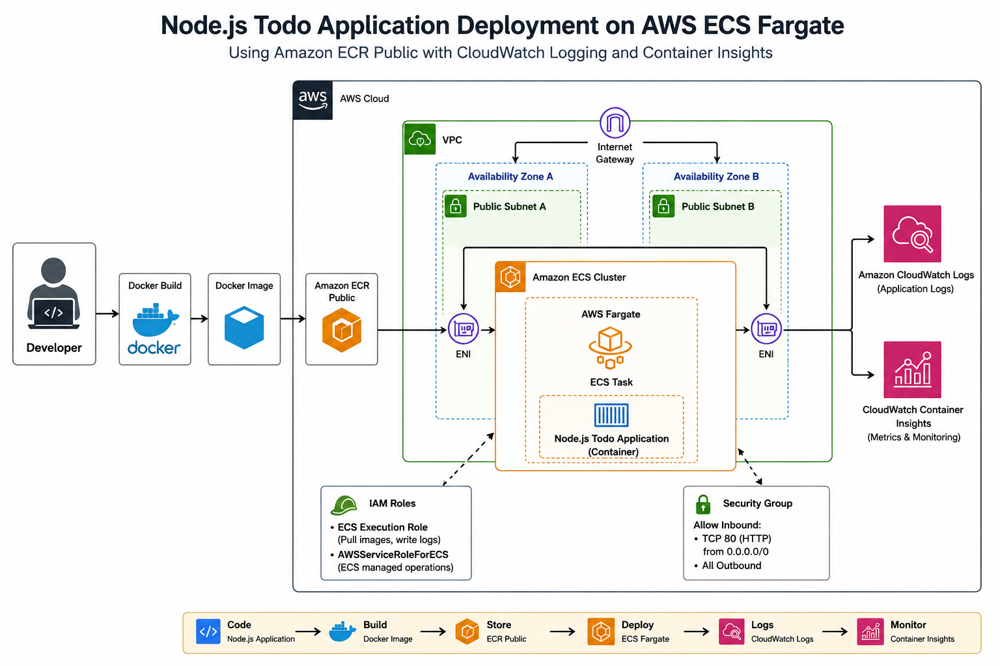

# AWS-ECS-Fargate-NODEJS-TODO
Containerized Node.js Todo Application deployed on AWS ECS Fargate using Amazon ECR Public with CloudWatch logging and Container Insights.


# Deploying a Containerized Node.js Todo Application on AWS ECS Fargate
A production-oriented demonstration of deploying a containerized Node.js Todo application on **Amazon ECS** using the **AWS Fargate** launch type. The application image is hosted in **Amazon ECR Public**, while **Amazon CloudWatch Logs** and **Container Insights** are used for monitoring and observability.
This project focuses on understanding the complete lifecycle of deploying containers on AWS without managing EC2 instances.

---

## Project Overview

The objective of this project is to deploy a Dockerized Node.js application on AWS using a serverless container platform.
The deployment includes:
- Dockerized Node.js Todo Application
- Amazon ECR Public for image storage
- Amazon ECS Cluster
- AWS Fargate Launch Type
- ECS Task Definition
- IAM Execution Role
- Amazon CloudWatch Logs
- CloudWatch Container Insights
- VPC Networking
- Security Groups
This project demonstrates a complete manual deployment workflow using the AWS Management Console and Docker CLI.

---

# Architecture


---

## Deployment Workflow

---
Developer
      │
      ▼
Docker Build
      │
      ▼
Docker Image
      │
      ▼
Amazon ECR Public
      │
      ▼
Amazon ECS Cluster
      │
      ▼
AWS Fargate
      │
      ▼
Running Container
      │
      ├────────► CloudWatch Logs
      │
      └────────► Container Insights


---

# AWS Services Used

| Service                      |                     Purpose                  |
|------------------------------|----------------------------------------------|
| Amazon ECS                   | Container orchestration                      |
| AWS Fargate                  | Serverless compute for containers            |
| Amazon ECR Public            | Stores Docker images                         |
| CloudWatch Logs              | Collects application logs                    |
| Container Insights           | Container monitoring and metrics             |
| VPC                          | Network isolation                            |
| Subnets                      | Task placement                               |
| Security Groups              | Network access control                       |
| IAM Execution Role           | Allows ECS to pull images and publish logs   |
| AWSServiceRoleForECS         | Enables ECS to manage AWS resources          |
 
---

# Repository Structure

```
aws-ecs-fargate-nodejs-todo
│
├── app.js
├── Dockerfile
├── package.json
├── package-lock.json
├── .gitignore
├── LICENSE
├── README.md
│
├── Architecture/image
|
├── views/
|
├── docs/documentation
```

---

# Deployment Summary

The deployment process consists of the following high-level steps:
1. Clone the repository
2. Build the Docker image
3. Tag the Docker image
4. Push the image to Amazon ECR Public
5. Create an ECS Cluster
6. Register a Task Definition
7. Run the task using AWS Fargate
8. Verify application accessibility
9. Monitor logs using CloudWatch
10. Monitor container metrics using Container Insights

Detailed implementation steps are available in the **docs/** directory.

---

# Monitoring

The application is monitored using:
- Amazon CloudWatch Logs
- CloudWatch Container Insights

The monitoring setup enables observation of:
- Container startup logs
- Application logs
- CPU Utilization
- Memory Utilization
- Network metrics
- Task health

---

# Key Learning Outcomes

Through this project, the following concepts were implemented and understood:
- Containerization using Docker
- Container image management with Amazon ECR Public
- Amazon ECS architecture
- AWS Fargate deployment
- ECS Task Definitions
- IAM Execution Roles
- ECS Networking using awsvpc mode
- CloudWatch logging
- Container monitoring with Container Insights
- Manual deployment workflow on AWS

---

# Skills Demonstrated

- AWS ECS
- AWS Fargate
- Amazon ECR Public
- Docker
- Node.js
- CloudWatch
- IAM
- VPC Networking
- Linux
- Container Deployment
- Cloud Monitoring

---

# Future Scope

This repository intentionally focuses on **manual deployment** to understand the core AWS container services.
Automation tools such as CI/CD pipelines, Infrastructure as Code, and orchestration platforms are intentionally excluded from this implementation.

---

# License

This project is intended for educational and learning purposes.

---

# Author

**Aditi Narang**
